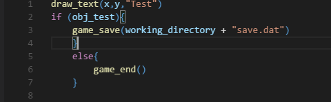

# gml-support README

GameMaker Language Support in Visual Studio Code.

GameMaker Language对Visual Studio Code的支持。

GitHub: [https://github.com/LiarOnce/gml-support](https://github.com/LiarOnce/gml-support)

# Known Issue

Syntax Highlignting may require theme support.

高亮功能可能需要主题支持。

# Screenshot

# Thanks

GameMaker Syntax：[YellowAfterlife](https://yal.cc/notepad-syntax-highlighting-for-gamemaker-81/)

GameMaker Studio Syntax：[Everspace/Sublime_GameMakerStudio](https://github.com/Everspace/Sublime_GameMakerStudio)

